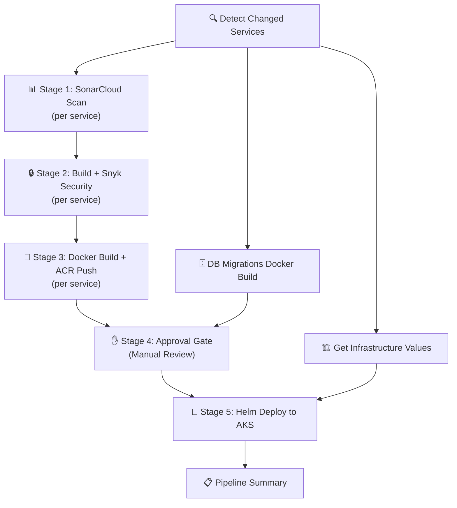
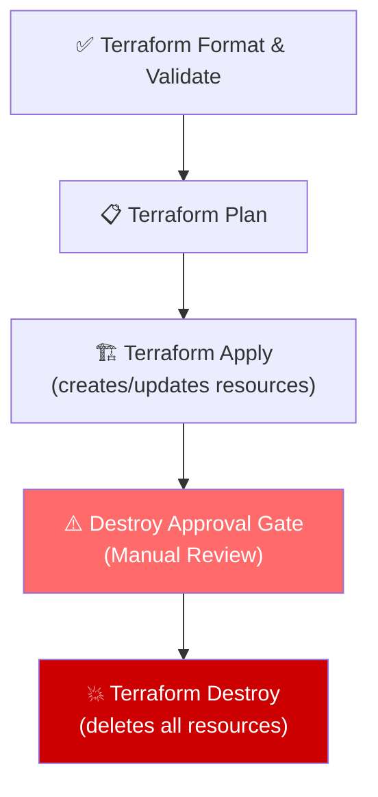

# DocBridge Pipelines — Complete Flow Explanation

> This document explains how the two DocBridge GitHub Actions pipelines work, stage by stage, in plain language. No prior DevOps knowledge is required.

---

## What Are These Pipelines?

DocBridge has **two automated pipelines** that run on GitHub Actions whenever code is pushed or manually triggered:

| Pipeline | File | Purpose |
|----------|------|---------|
| **Application CI/CD** | `cicd-application.yml` | Tests, scans, builds, and deploys the 11 DocBridge microservices |
| **Terraform Infrastructure** | `infra-terraform.yml` | Creates, updates, or destroys the Azure cloud infrastructure |

---

## Pipeline 1: Application CI/CD



### When Does It Trigger?

| Trigger | Condition |
|---------|-----------|
| **Automatic (push)** | When you push code to `main` that changes files inside `services/`, `gateway/`, `frontend/`, `database/`, or `helm/` |
| **Automatic (PR)** | When you open a Pull Request targeting `main` with changes in those same paths |
| **Manual** | Click "Run workflow" in GitHub Actions → optionally pick a specific service or "deploy all" |

> [!NOTE]
> Changes to **workflow files only** (`.github/workflows/`) do **not** trigger this pipeline. This prevents empty runs where no services are detected as changed.

### Stage-by-Stage Breakdown

#### Stage 0: Detect Changed Services
- **What it does**: Compares the current commit with the previous one to figure out **which services actually changed**.
- **Why it matters**: DocBridge has 11 services. If you only changed the `auth-service`, there's no reason to rebuild the `frontend`. This stage ensures only the affected services go through the pipeline.
- **Output**: A JSON list like `["auth-service", "frontend"]` that downstream stages use to decide whether to run.

#### Stage 0.5: Get Infrastructure Values from Terraform
- **What it does**: Runs `terraform output` to fetch live infrastructure values from Azure (ACR registry URL, Key Vault name, database hostname, Application Gateway IP, etc.).
- **Why it matters**: The Helm deploy step needs to know *where* to push Docker images and *what* database to connect to. These values come from the Terraform state, not hardcoded.
- **Only runs on**: Push to `main` or manual dispatch (not on PRs).

#### Stage 0.5: DB Migrations — Docker Build + Push
- **What it does**: Builds a Docker image containing the database migration scripts and pushes it to Azure Container Registry (ACR).
- **Only runs if**: Database files (`database/`) were changed.

#### Stage 1: SonarCloud SAST Scan (per service)
- **What it does**: Runs static code analysis on the source code of each changed service using SonarCloud.
- **What it checks**: Code smells, bugs, security vulnerabilities, code duplication.
- **Runs in parallel**: All changed services are scanned simultaneously.

#### Stage 2: Build + Snyk SCA Security (per service)
- **What it does**: Installs dependencies (`npm install`), builds the service, and runs Snyk to check for known vulnerabilities in third-party packages.
- **Depends on**: Stage 1 (SonarCloud) must pass first.
- **What Snyk checks**: CVEs in `node_modules` — e.g., "Does this version of `express` have a known security hole?"

#### Stage 3: Docker Build + Trivy Scan + ACR Push (per service)
- **What it does**:
  1. Builds a production Docker image for the service
  2. Scans the image with **Trivy** for container-level vulnerabilities
  3. Pushes the image to **Azure Container Registry** (ACR)
- **Depends on**: Stage 2 (Build + Snyk) must pass first.
- **Only runs on**: Push to `main` or manual dispatch (skipped on PRs).

#### Stage 4: Approval Gate (Manual Review)
- **What it does**: Pauses the pipeline and waits for a human to approve the deployment.
- **How it works**: The job targets the `production` GitHub Environment, which has **Required reviewers** enabled. GitHub automatically shows a "Review deployments" button. The pipeline sends an email notification to the team.
- **Depends on**: All Stage 3 Docker jobs must complete successfully (or be skipped for unchanged services).

> [!IMPORTANT]
> This is a **manual** gate. No code auto-approves it. A human must click "Approve and deploy" in GitHub Actions for the pipeline to continue.

#### Stage 5: Helm Deploy to AKS
- **What it does**:
  1. Logs into Azure and gets AKS cluster credentials
  2. Runs `helm upgrade --install` to deploy all services to Kubernetes
  3. Verifies pods are healthy with `kubectl get pods`
  4. Runs a smoke test against the Application Gateway health endpoint (with retry loop)
  5. If anything fails: automatically rolls back to the previous Helm release
- **Depends on**: Stage 4 (Approval) must be approved.
- **Notifications**: Sends success or failure+rollback emails.

#### Pipeline Summary
- **What it does**: Prints a summary of what happened — which services changed, whether DB migrations ran, and the application URL.
- **Always runs**: Even if earlier stages failed or were skipped.

---

## Pipeline 2: Terraform Infrastructure Pipeline



### When Does It Trigger?

| Trigger | Condition |
|---------|-----------|
| **Automatic (push)** | When you push code to `main` that changes files inside `terraform/` or `.github/workflows/infra-terraform.yml` |
| **Automatic (PR)** | Same paths as above |
| **Manual** | Click "Run workflow" → choose action: `plan`, `apply`, or `destroy` |

### How the Action Input Controls the Flow

The pipeline accepts a **manual input** called `action` with three options:

| Action | What Happens |
|--------|-------------|
| `plan` (default) | Runs Format → Plan and stops. Shows you what *would* change. |
| `apply` | Runs Format → Plan → Apply. Creates/updates real cloud resources. |
| `destroy` | Runs Format → Plan (with `-destroy` flag) → Apply is skipped → Destroy Approval Gate pauses → after approval, Terraform Destroy runs. |

On a **push to main**, the pipeline automatically runs Format → Plan → Apply (same as `action=apply`).

### Stage-by-Stage Breakdown

#### Stage 1: Terraform Format & Validate
- **What it does**:
  1. Checks that all `.tf` files follow the standard formatting (`terraform fmt -check`)
  2. Logs into Azure via OIDC (no passwords stored — uses federated identity)
  3. Initializes the Terraform backend (remote state stored in Azure Storage)
  4. Validates the configuration syntax (`terraform validate`)
- **If it fails**: Sends an email. Pipeline stops here.

#### Stage 2: Terraform Plan
- **What it does**: Generates a preview of what Terraform **would** do to your infrastructure.
- **For `apply` or push**: Shows resources to be created/updated.
- **For `destroy`**: Runs `terraform plan -destroy` to show resources to be **deleted**.
- **Output**: Saves the plan file as a GitHub artifact so the Apply step can use it.
- **On PRs**: Posts the plan output as a comment on the Pull Request for review.

#### Stage 3: Terraform Apply
- **When it runs**: Only on push to `main` OR manual dispatch with `action=apply`.
- **When it's skipped**: On PRs, on `action=plan`, and on `action=destroy`.
- **What it does**:
  1. Downloads the plan artifact from Stage 2
  2. Runs `terraform apply -auto-approve tfplan` to create/update Azure resources
  3. Captures all Terraform outputs (resource IDs, IP addresses, etc.) and saves them as artifacts
- **Notifications**: Sends success or failure emails.

#### Stage 4: Destroy Approval Gate
- **When it runs**: Only on manual dispatch with `action=destroy`.
- **When it's skipped**: On push, PR, `action=plan`, or `action=apply`.
- **What it does**: Targets the `production` GitHub Environment to pause for manual approval. Sends a **warning email** that infrastructure destruction is pending.

> [!CAUTION]
> This is the last safety checkpoint before all cloud resources are permanently deleted. A human reviewer must explicitly approve this step in GitHub Actions.

#### Stage 5: Terraform Destroy
- **When it runs**: Only after the Destroy Approval Gate is approved.
- **What it does**:
  1. Prints a bold warning banner
  2. Runs `terraform destroy -auto-approve` to delete **all** Azure resources in the resource group
  3. Sends a confirmation email that infrastructure has been torn down
- **This is irreversible**: All VMs, databases, networking, and storage will be deleted.

### Sequential Ordering

All 5 stages run **strictly in sequence**, never in parallel:

```
Format & Validate → Plan → Apply → Destroy Approval Gate → Destroy
```

If any stage is skipped (e.g., Apply is skipped on a destroy action), the next stage still runs — it doesn't get auto-cancelled. This is ensured by the `always()` condition in GitHub Actions.

---

## Quick Reference: What Runs When?

### Terraform Infrastructure Pipeline

| Event | Format | Plan | Apply | Destroy Gate | Destroy |
|-------|:------:|:----:|:-----:|:------------:|:-------:|
| Push to main (terraform changes) | ✅ | ✅ | ✅ | ⏭️ Skip | ⏭️ Skip |
| PR (terraform changes) | ✅ | ✅ | ⏭️ Skip | ⏭️ Skip | ⏭️ Skip |
| Manual: `action=plan` | ✅ | ✅ | ⏭️ Skip | ⏭️ Skip | ⏭️ Skip |
| Manual: `action=apply` | ✅ | ✅ | ✅ | ⏭️ Skip | ⏭️ Skip |
| Manual: `action=destroy` | ✅ | ✅ (with `-destroy`) | ⏭️ Skip | ✋ Wait | ✅ (after approval) |

### Application CI/CD Pipeline

| Event | Detect | Sonar | Build+Snyk | Docker+ACR | Approval | Deploy |
|-------|:------:|:-----:|:----------:|:----------:|:--------:|:------:|
| Push to main (service changes) | ✅ | ✅ | ✅ | ✅ | ✋ Wait | ✅ |
| PR (service changes) | ✅ | ✅ | ✅ | ⏭️ Skip | ⏭️ Skip | ⏭️ Skip |
| Manual: deploy_all=true | ✅ | ✅ | ✅ | ✅ | ✋ Wait | ✅ |
| Push (workflow-only changes) | **Not triggered** | — | — | — | — | — |
