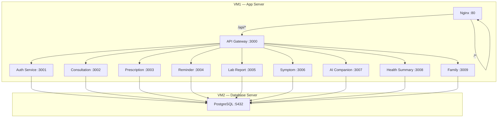

# DocBridge — Complete Production Codebase Generation

> "Because understanding your health shouldn't require a medical degree."

## Overview

Generate a complete, production-grade, fully runnable codebase for the **DocBridge** platform — an AI-powered post-consultation health companion. The system uses a microservices architecture with 9 backend services, an API gateway, a React frontend, PostgreSQL database, and Azure VM deployment scripts.

## Architecture Summary

## Proposed Changes

Given the scale (~150+ files), work will proceed in 8 sequential phases. Each phase generates all files for a logical component before moving to the next.

---

### Phase 1: Project Root & Database Layer

Root configuration files and complete database schema, migrations, seeders, and Sequelize config.

#### [NEW] Root Files
- `.gitignore`, `.env.example`, `README.md`, `docker-compose.yml`, `ecosystem.config.js`

#### [NEW] `database/schema.sql`
- Complete SQL schema with all 11 tables, indexes, triggers

#### [NEW] `database/config/config.js` + `database/.sequelizerc`
- Sequelize CLI configuration

#### [NEW] `database/migrations/` (11 migration files)
- One migration per table, in dependency order

#### [NEW] `database/seeders/` (6 seeder files)
- Demo data with user `arjun.mehta@gmail.com` / `Arjun@123`

---

### Phase 2: API Gateway

#### [NEW] `gateway/` (8 files)
- `package.json`, `.env.example`
- `src/server.js`, `src/app.js`
- `src/config/` — environment, logger, routes config
- `src/middleware/` — auth, rate limiter, request logger, error handler, CORS
- `src/proxy/serviceProxy.js` — http-proxy-middleware to all 9 services

---

### Phase 3: Backend Microservices (9 services)

Each service follows identical structure. Every file fully implemented.

#### [NEW] `services/auth-service/` (~15 files)
- Models: User, RefreshToken
- Full JWT auth with bcrypt, refresh tokens, profile management

#### [NEW] `services/consultation-service/` (~12 files)
- CRUD consultations, AI explain endpoint, stats

#### [NEW] `services/prescription-service/` (~12 files)
- CRUD prescriptions, active filter, side effects log, AI explain

#### [NEW] `services/reminder-service/` (~13 files)
- Medicine reminders, followup reminders, upcoming, scheduler

#### [NEW] `services/labreport-service/` (~12 files)
- CRUD lab reports, flagged values, trends, AI explain

#### [NEW] `services/symptom-service/` (~12 files)
- CRUD symptoms, ongoing, trends, AI insight

#### [NEW] `services/ai-companion-service/` (~14 files)
- Azure OpenAI integration, chat, explain endpoints, prompt engine, context builder

#### [NEW] `services/health-summary-service/` (~9 files)
- Dashboard aggregation, timeline from all services

#### [NEW] `services/family-service/` (~12 files)
- Family member CRUD

---

### Phase 4: React Frontend — Foundation

#### [NEW] `frontend/package.json`, `vite.config.js`, `tailwind.config.js`, `postcss.config.js`
#### [NEW] `frontend/public/index.html`
#### [NEW] `frontend/src/main.jsx`, `frontend/src/App.jsx`, `frontend/src/index.css`
#### [NEW] `frontend/src/utils/` (4 files)
#### [NEW] `frontend/src/hooks/` (4 files)
#### [NEW] `frontend/src/api/` (10 API client files)
#### [NEW] `frontend/src/store/` — Redux Toolkit store + 9 slices

---

### Phase 5: React Frontend — Components

#### [NEW] `frontend/src/components/layout/` (4 files)
- MainLayout, Sidebar, TopNav, MobileNav

#### [NEW] `frontend/src/components/common/` (12 files)
- Button, Input, Select, Modal, Card, Badge, Table, Pagination, LoadingSpinner, EmptyState, ErrorBoundary, ProtectedRoute

#### [NEW] `frontend/src/components/dashboard/` (5 files)
- StatsCard, HealthScoreWidget, UpcomingReminders, ActiveMedicines, QuickActions

#### [NEW] `frontend/src/components/ai/` (5 files)
- ChatMessage, ChatInput, TypingIndicator, SuggestedQuestions, MedicalDisclaimer

#### [NEW] `frontend/src/components/charts/` (3 files)
- SymptomTrendChart, MedicationAdherenceChart, LabResultsChart

---

### Phase 6: React Frontend — Pages

#### [NEW] `frontend/src/pages/` (17 page files)
- Landing, Login, Register, Dashboard, Consultations, ConsultationDetail, Prescriptions, PrescriptionDetail, Reminders, LabReports, LabReportDetail, Symptoms, AICompanion, HealthSummary, FamilyProfiles, Profile, NotFound

---

### Phase 7: Deployment Scripts

#### [NEW] `scripts/vm2-setup.sh` — PostgreSQL server setup
#### [NEW] `scripts/vm1-setup.sh` — App server setup with PM2, Nginx
#### [NEW] `scripts/health-check.sh` — System health verification
#### [NEW] `frontend/nginx.conf` — Nginx site config

---

### Phase 8: Documentation

#### [NEW] `docs/vm-deployment-guide.md`
#### [NEW] `docs/api-reference.md`
#### [NEW] `docs/postman/DocBridge.postman_collection.json`

---

## User Review Required

> [!IMPORTANT]
> **Frontend Styling**: The spec mentions `tailwind.config.js` in the project structure. I will use **TailwindCSS v3** for the frontend as implied by the spec. Confirm if you'd prefer vanilla CSS instead.

> [!IMPORTANT]
> **Execution Strategy**: This is ~150+ files totaling ~30,000+ lines of code. I will generate them sequentially in phases. Each phase will be fully complete before moving to the next. This will take significant time. Approve to begin.

> [!WARNING]
> **Azure OpenAI**: The AI Companion service calls Azure OpenAI. Without real credentials, those endpoints will return errors at runtime. The code will be fully implemented but needs real `AZURE_OPENAI_ENDPOINT`, `AZURE_OPENAI_KEY`, and deployment name in `.env`.

## Verification Plan

### Automated Tests
- Run `npm install` in each service to verify dependency resolution
- Run `node -c` syntax checks on all JS files
- Verify frontend builds with `npm run build`
- Check all services start without crash (requires DB)

### Manual Verification
- Review generated file structure matches spec exactly
- Verify all API routes match Section 6 specification
- Confirm database schema matches Section 4
- Test docker-compose local development flow
