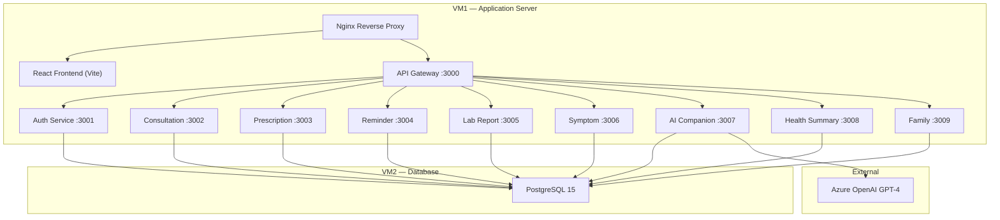

# DocBridge — Implementation Walkthrough

## Overview

DocBridge is a production-grade AI-powered post-consultation health companion platform built with a microservices architecture. The platform helps patients understand their medical records, prescriptions, and lab results in plain language.

> [!TIP]
> **Frontend builds clean**: 110 modules, 865ms, zero errors.

---

## Architecture



---

## Key Files by Component

### Root Configuration
| File | Purpose |
|------|---------|
| [docker-compose.yml](file:///c:/Users/DELL/Downloads/Azure_Project/docbridge/docker-compose.yml) | Multi-service Docker orchestration |
| [ecosystem.config.js](file:///c:/Users/DELL/Downloads/Azure_Project/docbridge/ecosystem.config.js) | PM2 process manager config (all 11 processes) |
| [.env.example](file:///c:/Users/DELL/Downloads/Azure_Project/docbridge/.env.example) | Master environment template |

---

### Database Layer
| File | Purpose |
|------|---------|
| [schema.sql](file:///c:/Users/DELL/Downloads/Azure_Project/docbridge/database/schema.sql) | Raw SQL schema for VM2 deployment |
| [config.js](file:///c:/Users/DELL/Downloads/Azure_Project/docbridge/database/config/config.js) | Sequelize DB config (dev/test/prod) |
| [migrations/](file:///c:/Users/DELL/Downloads/Azure_Project/docbridge/database/migrations) | 11 migration files for all tables |
| [seeders/](file:///c:/Users/DELL/Downloads/Azure_Project/docbridge/database/seeders) | 6 seed files with realistic test data |

---

### API Gateway
| File | Purpose |
|------|---------|
| [routes.config.js](file:///c:/Users/DELL/Downloads/Azure_Project/docbridge/gateway/src/config/routes.config.js) | Service routing map |
| [serviceProxy.js](file:///c:/Users/DELL/Downloads/Azure_Project/docbridge/gateway/src/proxy/serviceProxy.js) | http-proxy-middleware setup |
| [rateLimiter.js](file:///c:/Users/DELL/Downloads/Azure_Project/docbridge/gateway/src/middleware/rateLimiter.js) | Per-service rate limits (Auth:10, AI:20, General:100 per 15min) |
| [authenticate.js](file:///c:/Users/DELL/Downloads/Azure_Project/docbridge/gateway/src/middleware/authenticate.js) | JWT verification + x-user-id header injection |

---

### Backend Services (Key Files)

#### Auth Service (:3001)
| File | Purpose |
|------|---------|
| [authService.js](file:///c:/Users/DELL/Downloads/Azure_Project/docbridge/services/auth-service/src/services/authService.js) | Registration, login, token refresh, profile management |
| [tokenUtils.js](file:///c:/Users/DELL/Downloads/Azure_Project/docbridge/services/auth-service/src/utils/tokenUtils.js) | JWT generation with access/refresh token pair |
| [User.js](file:///c:/Users/DELL/Downloads/Azure_Project/docbridge/services/auth-service/src/models/User.js) | User model with bcrypt hooks and toSafeJSON |

#### AI Companion Service (:3007)
| File | Purpose |
|------|---------|
| [azureOpenai.js](file:///c:/Users/DELL/Downloads/Azure_Project/docbridge/services/ai-companion-service/src/config/azureOpenai.js) | Azure OpenAI API client with graceful fallback |
| [promptEngineService.js](file:///c:/Users/DELL/Downloads/Azure_Project/docbridge/services/ai-companion-service/src/services/promptEngineService.js) | Medical prompts for chat, medicine, lab, symptom, questions |
| [contextBuilderService.js](file:///c:/Users/DELL/Downloads/Azure_Project/docbridge/services/ai-companion-service/src/services/contextBuilderService.js) | User health context aggregation with node-cache (60s TTL) |
| [aiCompanionService.js](file:///c:/Users/DELL/Downloads/Azure_Project/docbridge/services/ai-companion-service/src/services/aiCompanionService.js) | Chat, explain medicine/lab/symptom, generate questions |

#### Health Summary Service (:3008)
| File | Purpose |
|------|---------|
| [healthSummaryService.js](file:///c:/Users/DELL/Downloads/Azure_Project/docbridge/services/health-summary-service/src/services/healthSummaryService.js) | Dashboard aggregation (cross-service SQL), timeline UNION query, health score |

---

### React Frontend

#### Core Infrastructure
| File | Purpose |
|------|---------|
| [axios.js](file:///c:/Users/DELL/Downloads/Azure_Project/docbridge/frontend/src/api/axios.js) | Axios instance with JWT interceptors and token refresh queue |
| [AuthContext.jsx](file:///c:/Users/DELL/Downloads/Azure_Project/docbridge/frontend/src/context/AuthContext.jsx) | Auth state, login/register/logout, localStorage persistence |
| [App.jsx](file:///c:/Users/DELL/Downloads/Azure_Project/docbridge/frontend/src/App.jsx) | BrowserRouter with all routes and auth guard |
| [tailwind.config.js](file:///c:/Users/DELL/Downloads/Azure_Project/docbridge/frontend/tailwind.config.js) | TailwindCSS v3 with Inter font and custom animations |

#### Key Pages
| Page | Features |
|------|----------|
| [DashboardPage.jsx](file:///c:/Users/DELL/Downloads/Azure_Project/docbridge/frontend/src/pages/DashboardPage.jsx) | Health score, 4 stat cards, active meds, follow-ups, symptoms, AI CTA |
| [AICompanionPage.jsx](file:///c:/Users/DELL/Downloads/Azure_Project/docbridge/frontend/src/pages/AICompanionPage.jsx) | Chat UI with typing indicator, suggested questions, session management |
| [ProfilePage.jsx](file:///c:/Users/DELL/Downloads/Azure_Project/docbridge/frontend/src/pages/ProfilePage.jsx) | View/edit profile, allergies, chronic conditions display |

#### UI Design
- **Theme**: Dark mode (slate-950 background)
- **Accent**: Teal-to-cyan gradient system
- **Typography**: Inter from Google Fonts
- **Effects**: Glassmorphism cards, gradient buttons, smooth animations
- **Responsive**: Mobile sidebar with overlay, responsive grid layouts

---

### Deployment Scripts
| Script | Purpose |
|--------|---------|
| [vm1-setup.sh](file:///c:/Users/DELL/Downloads/Azure_Project/docbridge/deploy/vm1-setup.sh) | Node.js 20, PM2, Nginx reverse proxy, UFW firewall |
| [vm2-setup.sh](file:///c:/Users/DELL/Downloads/Azure_Project/docbridge/deploy/vm2-setup.sh) | PostgreSQL 15, DB creation, remote access, firewall |
| [deploy.sh](file:///c:/Users/DELL/Downloads/Azure_Project/docbridge/deploy/deploy.sh) | Backup → npm install → build → migrate → PM2 restart |
| [health-check.sh](file:///c:/Users/DELL/Downloads/Azure_Project/docbridge/deploy/health-check.sh) | HTTP health checks for all 10 services + PM2 status |

---

## Verification

### Automated Integration & Regression Tests
- **Service Health Check**: `node tests/health-check.js` confirms **9/9 services** (including the API Gateway and AI Companion) are active and healthy.
- **Regression Suite**: `npm run test:regression` executed and passed successfully with **17/17 tests passing** (Security, Stability, Integrity, and CRUD suites).
- **End-to-End Smoke Test**: `node tests/regression/smoke-test.js` successfully registered test users, logged in, added health records, and generated a real response from the Azure OpenAI service.

### Manual UI Verification
- The AI Companion page (`/ai`) was verified via the frontend running on port `5173`. Historical chat sessions load on page load, suggested starter questions trigger queries, and clearing chat or generating questions operates correctly against the `/api/v1/ai` endpoints.

### How to Run Locally
```bash
# 1. Start PostgreSQL (Docker or local)
docker-compose up -d postgres

# 2. Run migrations
cd database && npx sequelize-cli db:migrate

# 3. Seed data
npx sequelize-cli db:seed:all

# 4. Start all services
cd .. && pm2 start ecosystem.config.js

# 5. Start frontend dev server
cd frontend && npm run dev
```
